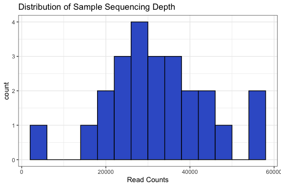
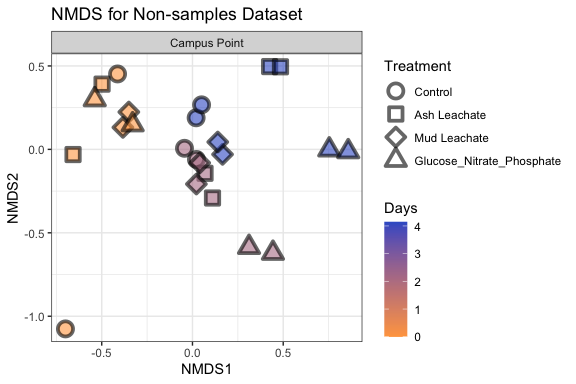
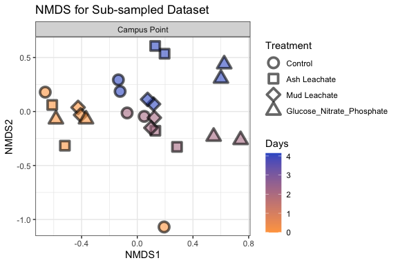
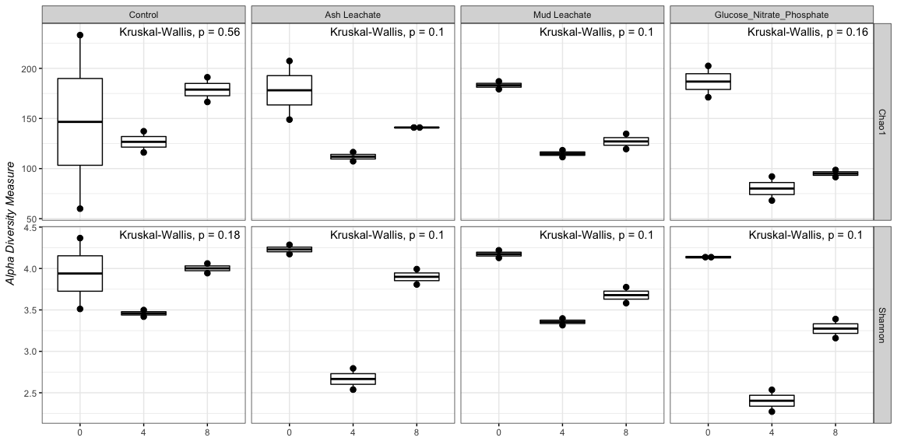
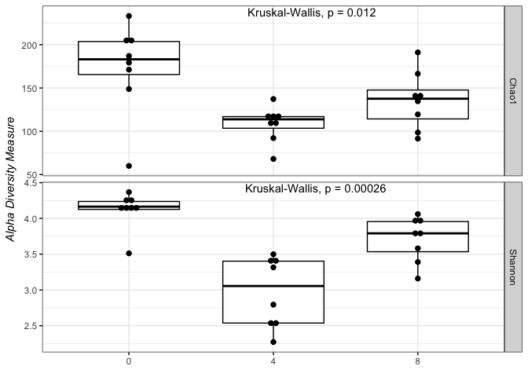
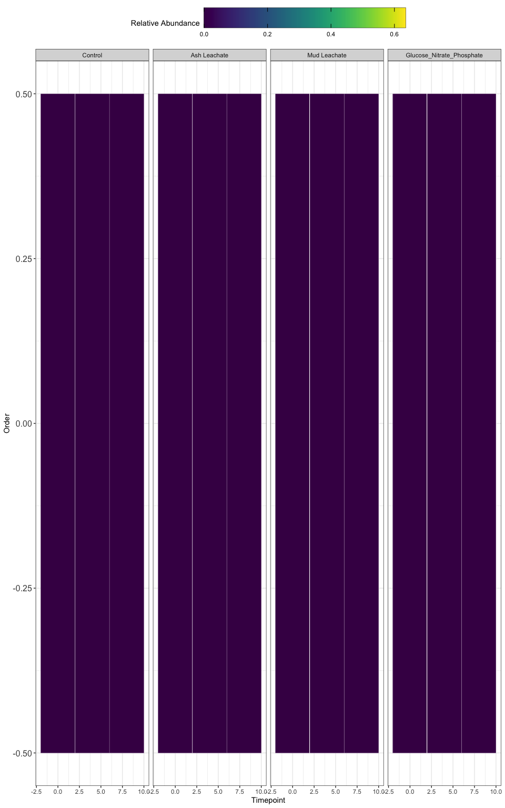

Phyloseq
================
Melia Hodson
11/17/2020

# Intro

We explore the processed 2018 sequences using
[phyloseq](https://joey711.github.io/phyloseq/)

# Install phyloseq

``` r
# BiocManager::install("phyloseq")
```

``` r
library(tidyverse)
library(phyloseq)
library(RColorBrewer)
library(readxl)
```

# Import Data

``` r
count.tab <- read_rds("~/Desktop/Github/144L_demo/stuff/Input_Data/week6/seqtab-nochimtaxa.rds")
# Table of counts for each sequence in each sample
tax.tab <- read_rds("~/Desktop/Github/144L_demo/stuff/Input_Data/week6/taxa.rds")

metadata <- read_excel("~/Desktop/Github/144L_demo/stuff/Input_Data/week4/144L_2018_Exp_TOC.xlsx", sheet = "Metadata") %>% 
  select(Treatment, Bottle, Timepoint, DNA_SampleID)
sample.tab.noID <- read_rds("~/Desktop/Github/144L_demo/stuff/Output_Data/Week 4/2018_Experiment_Processed_DOC_BGE.Rmd")
sample.tab <- left_join(sample.tab.noID, metadata) %>% 
  drop_na(DNA_SampleID) %>% 
  column_to_rownames(var = "DNA_SampleID")
```

    ## Joining, by = c("Bottle", "Timepoint", "Treatment")

``` r
# Table that matches ASV to sequence
# sample.tab  %>% 
  # drop_na(DNA_SampleID) %>% 
  # column_to_rownames(var = "DNA_SampleID")

glimpse(sample.tab)
```

    ## Rows: 24
    ## Columns: 64
    ## $ Experiment           <chr> "144L_2018", "144L_2018", "144L_2018", "144L_201…
    ## $ Location             <chr> "Campus Point", "Campus Point", "Campus Point", …
    ## $ Temperature          <dbl> 20, 20, 20, 20, 20, 20, 20, 20, 20, 20, 20, 20, …
    ## $ Depth                <dbl> 1, 1, 1, 1, 1, 1, 1, 1, 1, 1, 1, 1, 1, 1, 1, 1, …
    ## $ Bottle               <chr> "A", "A", "A", "B", "B", "B", "C", "C", "C", "D"…
    ## $ Timepoint            <dbl> 0, 4, 8, 0, 4, 8, 0, 4, 8, 0, 4, 8, 0, 4, 8, 0, …
    ## $ Treatment            <chr> "Control", "Control", "Control", "Control", "Con…
    ## $ Target_DOC_Amendment <dbl> 0, 0, 0, 0, 0, 0, 10, 10, 10, 10, 10, 10, 10, 10…
    ## $ Inoculum_L           <dbl> 1.5, 1.5, 1.5, 1.5, 1.5, 1.5, 1.5, 1.5, 1.5, 1.5…
    ## $ Media_L              <dbl> 3.5, 3.5, 3.5, 3.5, 3.5, 3.5, 3.5, 3.5, 3.5, 3.5…
    ## $ Datetime             <dttm> 2018-10-15 16:30:00, 2018-10-17 20:00:00, 2018-…
    ## $ hours                <dbl> 0.0, 51.5, 99.5, 0.0, 51.5, 99.5, 0.0, 51.5, 99.…
    ## $ days                 <dbl> 0.000000, 2.145833, 4.145833, 0.000000, 2.145833…
    ## $ TOC                  <dbl> 81.30000, 81.77997, 78.87473, 80.80000, 80.25890…
    ## $ sd_TOC               <dbl> 0.40000000, NA, 0.38725049, 0.20000000, 0.030696…
    ## $ PTOC                 <dbl> 81.3, 79.5, 78.3, 80.8, 80.8, 79.3, 91.1, 86.6, …
    ## $ sd_PTOC              <dbl> 0.4, 0.6, 0.2, 0.2, 1.0, 0.7, NA, 0.4, 0.6, 0.4,…
    ## $ cells                <dbl> 332531522, 933025234, 967204148, 389243418, 1106…
    ## $ ln_cells             <dbl> 19.62225, 20.65394, 20.68992, 19.77972, 20.82448…
    ## $ diff_ln_cells        <dbl> 0.00000000, 0.02829106, 0.16697475, 0.00000000, …
    ## $ bc                   <dbl> 0.8313288, 2.3325631, 2.4180104, 0.9731085, 2.76…
    ## $ ave_bc               <dbl> 0.9022187, 2.5494210, 2.2426862, 0.9022187, 2.54…
    ## $ sd_bc                <dbl> 0.100253415, 0.306683427, 0.247945833, 0.1002534…
    ## $ interv               <Interval> 2018-10-15 16:30:00 UTC--2018-10-15 16:30:0…
    ## $ exp_start            <dbl> 0, 0, 0, 0, 0, 0, 0, 0, 0, 0, 0, 0, 0, 0, 0, 0, …
    ## $ exp_end              <dbl> 1, 1, 1, 1, 1, 1, 1, 1, 1, 1, 1, 1, 1, 1, 1, 1, …
    ## $ ln_cells_exp_start   <dbl> 19.62225, 19.62225, 19.62225, 19.77972, 19.77972…
    ## $ ln_cells_exp_end     <dbl> 20.07689, 20.07689, 20.07689, 20.10741, 20.10741…
    ## $ cells_exp_start      <dbl> 332531522, 332531522, 332531522, 389243418, 3892…
    ## $ cells_exp_end        <dbl> 523943125, 523943125, 523943125, 540180187, 5401…
    ## $ days_exp_start       <dbl> 0, 0, 0, 0, 0, 0, 0, 0, 0, 0, 0, 0, 0, 0, 0, 0, …
    ## $ days_exp_end         <dbl> 0.6458333, 0.6458333, 0.6458333, 0.6458333, 0.64…
    ## $ mu                   <dbl> 0.7039718, 0.7039718, 0.7039718, 0.5074031, 0.50…
    ## $ doubling             <dbl> 0.9846235, 0.9846235, 0.9846235, 1.3660680, 1.36…
    ## $ delta_cells          <dbl> 191411603, 191411603, 191411603, 150936769, 1509…
    ## $ delta_bc             <dbl> 0.4785290, 0.4785290, 0.4785290, 0.3773419, 0.37…
    ## $ ave_mu               <dbl> 0.6056875, 0.6056875, 0.6056875, 0.6056875, 0.60…
    ## $ sd_mu                <dbl> 0.1011337605, 0.1011337605, 0.1011337605, 0.1011…
    ## $ ave_doubling         <dbl> 1.1753457, 1.1753457, 1.1753457, 1.1753457, 1.17…
    ## $ sd_doubling          <dbl> 0.1962515880, 0.1962515880, 0.1962515880, 0.1962…
    ## $ ave_delta_cells      <dbl> 171174186, 171174186, 171174186, 171174186, 1711…
    ## $ sd_delta_cells       <dbl> 20824130, 20824130, 20824130, 20824130, 20824130…
    ## $ ave_delta_bc         <dbl> 0.4279355, 0.4279355, 0.4279355, 0.4279355, 0.42…
    ## $ sd_delta_bc          <dbl> 0.052060326, 0.052060326, 0.052060326, 0.0520603…
    ## $ ave_lag              <dbl> 0, 0, 0, 0, 0, 0, 0, 0, 0, 0, 0, 0, 0, 0, 0, 0, …
    ## $ sd_lag               <dbl> 0, 0, 0, 0, 0, 0, 0, 0, 0, 0, 0, 0, 0, 0, 0, 0, …
    ## $ interp_toc           <dbl> 81.3, 79.5, 78.3, 80.8, 80.8, 79.3, 91.1, 86.6, …
    ## $ interp_bc            <dbl> 0.8, 2.3, 2.4, 1.0, 2.8, 2.1, 0.8, 3.4, 0.7, 0.9…
    ## $ doc                  <dbl> 80.5, 77.2, 75.9, 79.8, 78.0, 77.2, 90.3, 83.2, …
    ## $ bioav_doc            <dbl> 79.55714, 79.55714, 79.55714, 78.83258, 78.83258…
    ## $ doc_exp_end          <dbl> 79.5, 79.5, 79.5, 79.4, 79.4, 79.4, 87.2, 87.2, …
    ## $ delta_doc            <dbl> 1.0, 1.0, 1.0, 0.4, 0.4, 0.4, 3.1, 3.1, 3.1, 3.7…
    ## $ tdelta_doc           <dbl> 4.6, 4.6, 4.6, 2.6, 2.6, 2.6, 8.3, 8.3, 8.3, 7.8…
    ## $ bge                  <dbl> NA, NA, NA, NA, NA, NA, 0.5321060, 0.5321060, 0.…
    ## $ ave_toc              <dbl> 81.05, 80.15, 78.80, 81.05, 80.15, 78.80, 91.25,…
    ## $ sd_toc               <dbl> 0.35355339, 0.91923882, 0.70710678, 0.35355339, …
    ## $ ave_bioav_doc        <dbl> 79.19486, 79.19486, 79.19486, 79.19486, 79.19486…
    ## $ sd_bioav_doc         <dbl> 0.37169216, 0.37169216, 0.37169216, 0.37169216, …
    ## $ ave_delta_doc        <dbl> 0.70, 0.70, 0.70, 0.70, 0.70, 0.70, 3.40, 3.40, …
    ## $ sd_delta_doc         <dbl> 0.3077935, 0.3077935, 0.3077935, 0.3077935, 0.30…
    ## $ ave_tdelta_doc       <dbl> 3.60, 3.60, 3.60, 3.60, 3.60, 3.60, 8.05, 8.05, …
    ## $ sd_tdelta_doc        <dbl> 1.02597835, 1.02597835, 1.02597835, 1.02597835, …
    ## $ ave_bge              <dbl> NA, NA, NA, NA, NA, NA, 0.5246395, 0.5246395, 0.…
    ## $ sd_bge               <dbl> NA, NA, NA, NA, NA, NA, 0.007660469, 0.007660469…

``` r
row.names(sample.tab)
```

    ##  [1] "144_A0_S6"  "144_A4_S7"  "144_A8_S8"  "144_B0_S9"  "144_B4_S10"
    ##  [6] "144_B8_S11" "144_C0_S12" "144_C4_S13" "144_C8_S14" "144_D0_S15"
    ## [11] "144_D4_S16" "144_D8_S17" "144_E0_S18" "144_E4_S19" "144_E8_S20"
    ## [16] "144_F0_S21" "144_F4_S22" "144_F8_S23" "144_G0_S24" "144_G4_S25"
    ## [21] "144_G8_S26" "144_H0_S27" "144_H4_S28" "144_H8_S29"

# Phyloseq Object

We need to create a phyloseq object that merges all three datasets.
Sometimes this doesn’t work because of the format of the data files.
Make sure all the sample names between the sampleinfo.txt and
seqtab-nochimtaxa.txt are the same

``` r
OTU = otu_table(count.tab, taxa_are_rows = T)
TAX = tax_table(tax.tab)
SAM = sample_data(sample.tab)
ps = phyloseq(OTU, TAX, SAM)
```

# Filter Sequences

We will filter out chloroplasts and mitochondria, because we only
intended to amplify bacterial sequences. It’s good to check you don’t
have anything lurking in the taxonomy table.

``` r
sub_ps <- ps %>% 
  subset_taxa(Family != "mitochondria" & Order != "Chloroplast")
```

# Sample Summary

As a first analysis, we will look at the distribution of read counts
from our samples


The Distribution shows the majority of the read counts lie between 2000
and 4000 read counts. However there is also a spike of reads closer to
6000 reads.

``` r
# Mean, max, and min of sample read counts
summary(sample_sum_df)
```

    ##       sum       
    ##  Min.   : 2432  
    ##  1st Qu.:25612  
    ##  Median :31642  
    ##  Mean   :32384  
    ##  3rd Qu.:39275  
    ##  Max.   :57602

# Beta Diversity

Beta diversity involves calculating metrics such as distances or
dissimilarities based on pairwise comparisons of samples - they don’t
exist for a single sample, but rather only as metrics that relate
samples to each other. i.e. beta diversity = patterns in community
structure between samples

Since differences in sampling depths between samples can influence
distances/dissimilarity metrics, we first need to somehow normalize the
read depth across our samples.

## Subsample

We will rarefy (random subsample with replacement) the read depth of the
samples first (scale to the smallest library size).

Read depth is an artifact of a machine made by a company in San Diego,
not anything about your samples or biology. It is totally artifactual,
and controlling for artifacts is critical in science. Subsampling
randomly is the simplest way to control for this, and the question is
whether this is the “best” way of controlling for it.

A strong reason to subsample is to standardize effort. The bottom line
is that in all experimental design you should not be comparing things to
which you devote different effort in resolution. You standardize effort.

The bigger your differential in mean(or median) read depth(reads/sample)
between pre- and post-subsampling, the greater the “effect” on beta
diversity.

We will subsample to the minimum read depth of all samples and not
subsample. We’ll then compare the mean reads pre- and post-subsampling
and also compare beta diversity patterns.

``` r
ps_min <- rarefy_even_depth(sub_ps, sample.size = min(sample_sums(sub_ps)))
```

    ## You set `rngseed` to FALSE. Make sure you've set & recorded
    ##  the random seed of your session for reproducibility.
    ## See `?set.seed`

    ## ...

    ## 129OTUs were removed because they are no longer 
    ## present in any sample after random subsampling

    ## ...

``` r
mean(sample_sums(sub_ps)) # 31642 = median
```

    ## [1] 32384.12

``` r
mean(sample_sums(ps_min)) # 2432 = min
```

    ## [1] 2432

There is a big differential between the median (31642) and the minimum
read depth (2432), which means the random subsampling could have a
larger effect on our beta diversity.

## NMDS

One of the best exploratory analyses for amplicon data is unconstrained
ordinations. Here we will look at non-metric multidimensional scaling
(NMDS) ordination of our full community samples. For NMDS plots it’s
important to set a seed since the starting positions of samplings in the
algorithm is random.

We are running 2 sets of ordinations here, the first object (nmds) will
be on the non-sampled dataset, and the second (nmds\_min) will be on the
sub-sampled dataset.

``` r
set.seed(1)
# Ordinate
nmds <- ordinate(sub_ps, method = "NMDS", distance = "bray") # Stress = 0.07 - 0.15
```

    ## Square root transformation
    ## Wisconsin double standardization
    ## Run 0 stress 0.07022425 
    ## Run 1 stress 0.07022425 
    ## ... New best solution
    ## ... Procrustes: rmse 8.953546e-06  max resid 3.234227e-05 
    ## ... Similar to previous best
    ## Run 2 stress 0.1550903 
    ## Run 3 stress 0.07022426 
    ## ... Procrustes: rmse 2.501643e-05  max resid 9.382126e-05 
    ## ... Similar to previous best
    ## Run 4 stress 0.07091862 
    ## Run 5 stress 0.07022425 
    ## ... Procrustes: rmse 9.635158e-06  max resid 3.647193e-05 
    ## ... Similar to previous best
    ## Run 6 stress 0.08424625 
    ## Run 7 stress 0.1572984 
    ## Run 8 stress 0.07337268 
    ## Run 9 stress 0.1577802 
    ## Run 10 stress 0.1220012 
    ## Run 11 stress 0.1176713 
    ## Run 12 stress 0.07091866 
    ## Run 13 stress 0.1212438 
    ## Run 14 stress 0.08370313 
    ## Run 15 stress 0.07091862 
    ## Run 16 stress 0.07337259 
    ## Run 17 stress 0.08410975 
    ## Run 18 stress 0.07022426 
    ## ... Procrustes: rmse 1.461924e-05  max resid 4.078271e-05 
    ## ... Similar to previous best
    ## Run 19 stress 0.08309136 
    ## Run 20 stress 0.07022426 
    ## ... Procrustes: rmse 1.825141e-05  max resid 5.88258e-05 
    ## ... Similar to previous best
    ## *** Solution reached

``` r
set.seed(1)
# Ordinate
nmds_min <- ordinate(ps_min, method = "NMDS", distance = "bray") # Stress = 0.07
```

    ## Square root transformation
    ## Wisconsin double standardization
    ## Run 0 stress 0.08200605 
    ## Run 1 stress 0.1481627 
    ## Run 2 stress 0.08270569 
    ## Run 3 stress 0.08200605 
    ## ... Procrustes: rmse 8.743514e-07  max resid 2.076639e-06 
    ## ... Similar to previous best
    ## Run 4 stress 0.0827057 
    ## Run 5 stress 0.1551217 
    ## Run 6 stress 0.08200606 
    ## ... Procrustes: rmse 2.311569e-05  max resid 8.846565e-05 
    ## ... Similar to previous best
    ## Run 7 stress 0.1720729 
    ## Run 8 stress 0.08270569 
    ## Run 9 stress 0.1684498 
    ## Run 10 stress 0.1380857 
    ## Run 11 stress 0.1338247 
    ## Run 12 stress 0.08270568 
    ## Run 13 stress 0.1479873 
    ## Run 14 stress 0.1618344 
    ## Run 15 stress 0.08270568 
    ## Run 16 stress 0.1481626 
    ## Run 17 stress 0.09609054 
    ## Run 18 stress 0.08200606 
    ## ... Procrustes: rmse 1.384878e-05  max resid 3.691047e-05 
    ## ... Similar to previous best
    ## Run 19 stress 0.09480566 
    ## Run 20 stress 0.09609054 
    ## *** Solution reached

We can now plot our ordinances now that they are stored in objects.


Based on this plot, for all the treatments their similarities were
scattered at day 0. Approaching day 2 Ash Leachate and Mud Leachate both
show a higher similarity to each other, with the control also nearby.
The Glucose Nitrate Phosphate is much more dissimilar to the rest of the
treatments at day 2. On day 4 all of the treatments show much more
dissimilarity between the different communities with Glucose Nitrate
Phosphate being the most dissimilar.


Similar to the previous plot, the communities are more scattered at day
0 with the Mud Leachate treatment being the most similar. Day 2 shows
the Mud Leachate and Control being the most similar and Glucose Nitrate
Phosphate being most dissimilar. On Day 4 all the treatments are much
more dissimilar compared to the previous days with Glucose Nitrate
Phosphate being the most dissimilar.

NMDS plots attempt to show ordinal distances between samples as
accurately as possible in two dimensions. It is important to report the
stress of these plots, because a high stress value means that the
algorithm had a hard time representing the distances between samples in
2 dimensions. The stress of this plot was good - it was 0.04 (generally
anything below 0.2 is considered acceptable)

Sub-sampling doesn’t appear the pattern we see in beta diversity, so
moving forward, we will focus on the sub-sampled dataset.

# Alpha Diversity

We are going to calculate the Chao1 index for richness and the Shannon
diversity index.

\*\* It is important to note that the alpha diversity values are not
interpreted as “real” numbers of anything (due to the nature of amplicon
data), but they can still be useful as relative metrics of comparison.
If Chao1 richness goes up, but Shannon diversity goes down, it indicates
that the sample may have more ASVs but is dominated by a few of them
\*\*

We will use the subsampled library, which retains estimates of the
species abundance of the real population while standardizing sampling
effort.

``` r
richness <- estimate_richness(ps_min, measures = c("Chao1", "Shannon")) %>% 
  rownames_to_column(., var = "DNA_ID") %>% 
  mutate_at(vars(DNA_ID), str_replace_all, "X144_","144_")
```

Let’s add the sample metadata into this dataframe now.

``` r
alphadiv <- left_join(richness, sample.tab %>% 
                        rownames_to_column(., var = "DNA_ID"))
```

    ## Joining, by = "DNA_ID"



Boxes represent the 1.5 interquartile range, with the internal solid
line are representing the median. Circles represent data points.
p-values are reported the non-parametric two sample Wilcoxon test, which
tests whether the means between two groups are equal (ns: p \> 0.05, \*
:ps =\< 0.05, \*\* :p =\< 0.01).

Difference in the alpha diversity indexes among conditions were tested
using pairwise Wilcoxon tests; p \< 0.05 was considered the threshold
significance for a difference between conditions.

From this plot we can see within the treatments that both the richness
and diversity decrease by timepoint 4 which may correspond with
stationary growth. The plots show that both the richness (via Chao1
index) of our samples and the overall diversity (via Shannon index)
significantly changes. Notably, the n value is not ideal so alpha
diversity measures likely won’t hold as much weight. The Mud Leachate
has the smallest change for both richness and overall diversity across
timepoints. The Ash Leachate and the Glucose Nitrate Phosphate show
similar results in both their overall diversity and richness, starting
higher, dropping around timepoint 4, then increasing again. The Control
stayed relatively constant across timepoints with much less variation
compared to the treatments.

``` r
alpha.plot2 <- ggboxplot(pivot.data, x = "Timepoint", y = "est", 
                        palette = c("royalblue3", "tan1"),
                        xlab = expression(italic(paste(""))),
                        ylab = expression(italic(paste("Alpha Diversity Measure"))),
                        add = "dotplot",
                        width = 0.7,
                        ggtheme = theme_bw()) +
  stat_compare_means(label.x = "4") +
  facet_grid(rows = "measure", scales = "free")
alpha.plot2
```

    ## `stat_bindot()` using `bins = 30`. Pick better value with `binwidth`.

<!-- -->

# Who?

Which taxa were important? Which taxa were contributing to the change in
community composition?

\*\* Note: Recovered 16 rRNA gene copy numbers do not equal organism
abundance. \*\*

That said, we can generate a heat map of our samples showing us how the
relative abundance of different taxonomic group change… potentially
giving us a visual of which taxa are most important to the alpha and
beta diversity patterns we observed.

First we’re going to generate a custom table that will be easier to work
with than a phyloseq object.

## Generate Relative Abundance

Our data currently shows number gene copies recovered, so we’ll convert
to percentages (relative abundance)

``` r
ps_std <- transform_sample_counts(ps_min, function(x) x/sum(x))
# Extract the relative abundance table and coerce into dataframe
ps_std.tab <- as(otu_table(ps_std), "matrix")
ps_std.df = as.data.frame(ps_std.tab)
```

## Make Table

``` r
custom.tab <- as.data.frame(tax.tab)
# Then combine the data frame
tax.df <- as.data.frame(tax.tab)

custom.tab <- tax.df %>% 
  rownames_to_column(., var = "asv") %>% 
  left_join(., ps_std.df %>%  rownames_to_column(., var = "asv")) %>% 
  mutate(pco = paste(Phylum, "_", Class, "_", Order)) %>% 
  select(-c(asv:Genus)) %>% 
  select(pco, everything()) %>% 
  group_by(pco) %>% 
  summarize_at(vars(contains("144")), sum, na.rm = T) %>% 
  ungroup()
```

    ## Joining, by = "asv"

``` r
# Save the row names and then make them into the column names
colnames <- custom.tab[, 1]

# Transpose the dataframe so we can merge with the sample info table
t_custom.tab <- as.data.frame(t(custom.tab[, -1]))

colnames(t_custom.tab) <- colnames$pco

# Merge
sweet.tab <- t_custom.tab %>% 
  rownames_to_column(., var = "sample") %>% 
  left_join(., sample.tab %>%  rownames_to_column(., var = "sample") %>% select(sample, Experiment, Bottle, Treatment, Timepoint, days, cells)) %>% 
  select(sample, Experiment:cells, everything())
```

    ## Joining, by = "sample"

``` r
relabund <- sweet.tab %>% 
  select(-c(sample:cells)) %>% 
  .[, colSums(.) > 0] %>% 
  .[, order(colSums(-.))] %>% 
  bind_cols(sweet.tab %>%  select(sample:cells), .)
```

## Heatmap


It looks like the ASVs belonging to

# Save and Knit

``` r
saveRDS(sweet.tab, "~/Desktop/Github/144L_demo/stuff/Output_Data/Week 6/Custom_ASV_table.rds")
saveRDS(sub_ps, "~/Desktop/Github/144L_demo/stuff/Output_Data/Week 6/phyloseq_obj.rds")
saveRDS(ps_min, "~/Desktop/Github/144L_demo/stuff/Output_Data/Week 6/subsampled_phyloseq_obj.rds")
saveRDS(alphadiv, "~/Desktop/Github/144L_demo/stuff/Output_Data/Week 6/alphadiv.rds")
```
